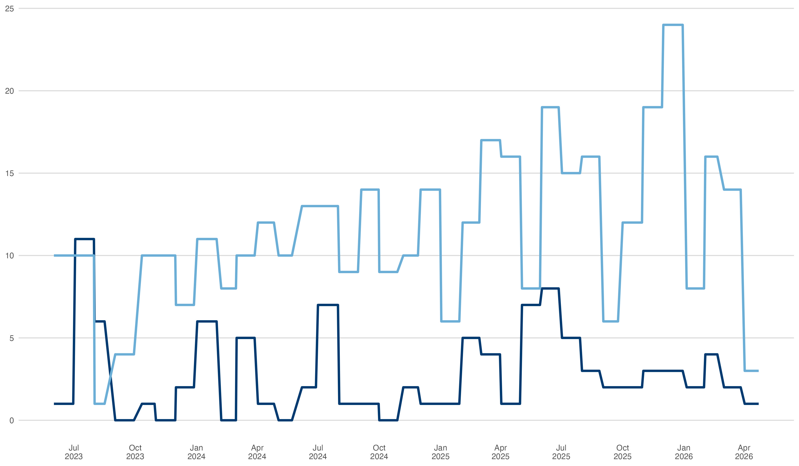

# Stage_BxSE

## Summary of figures / Main results 

*Monthly SEP case volumes exhibit a clear upward trajectory, reaching a peak in late 2025, whereas non-SEP litigation remains relatively stable at low levels*

