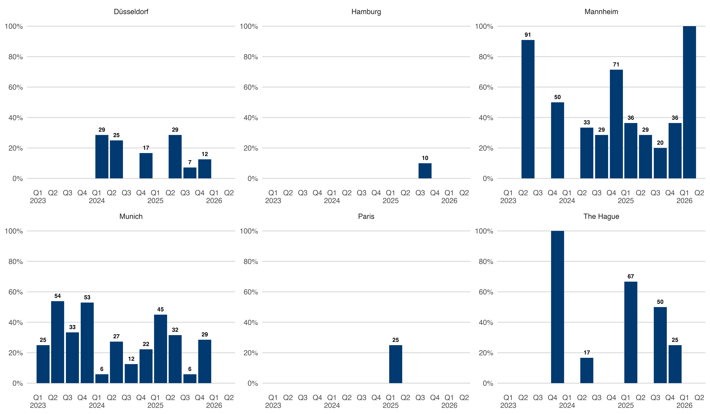
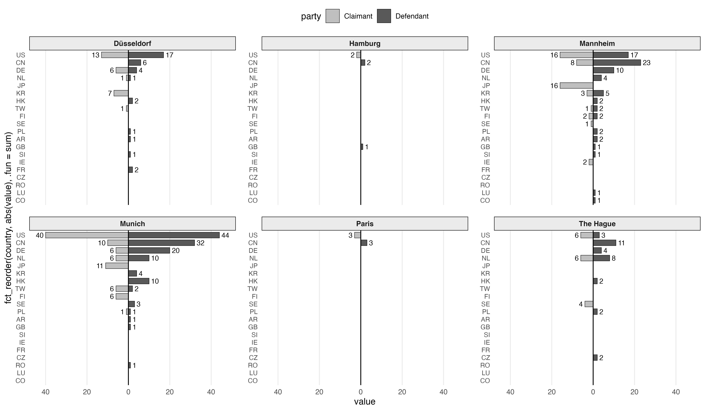
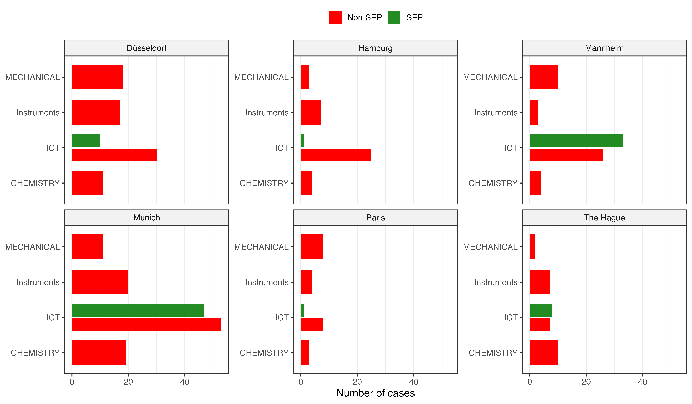
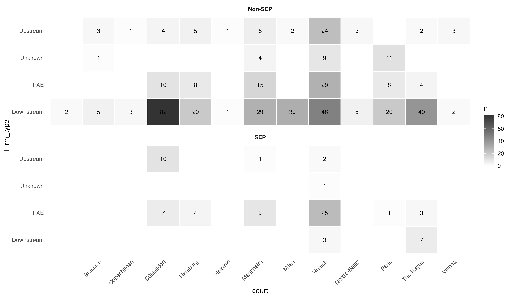
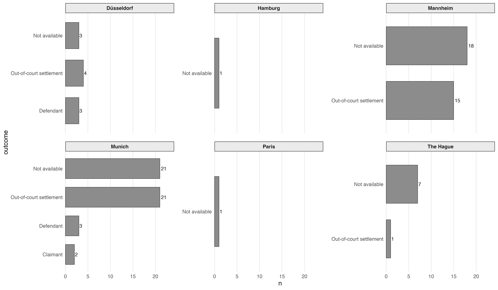
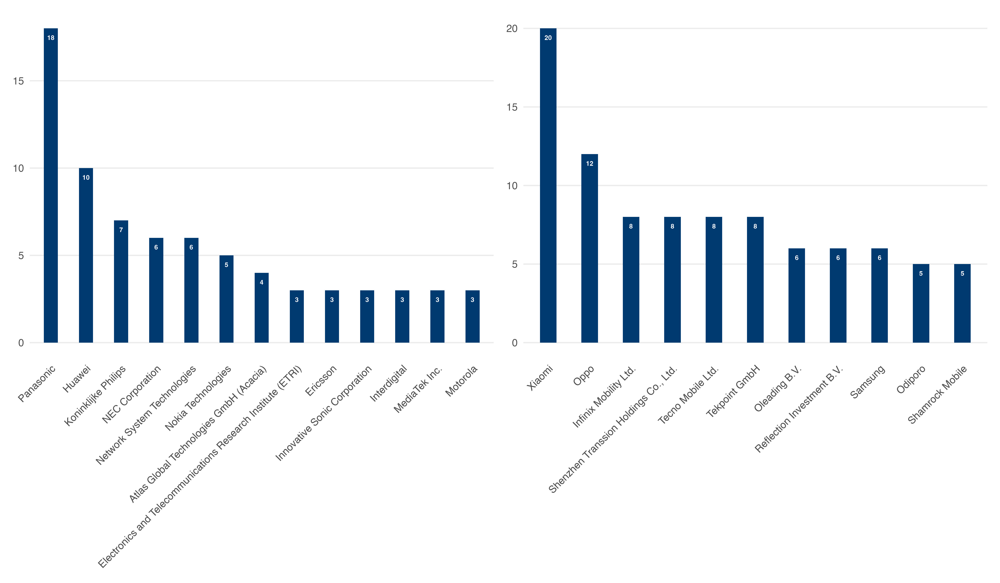
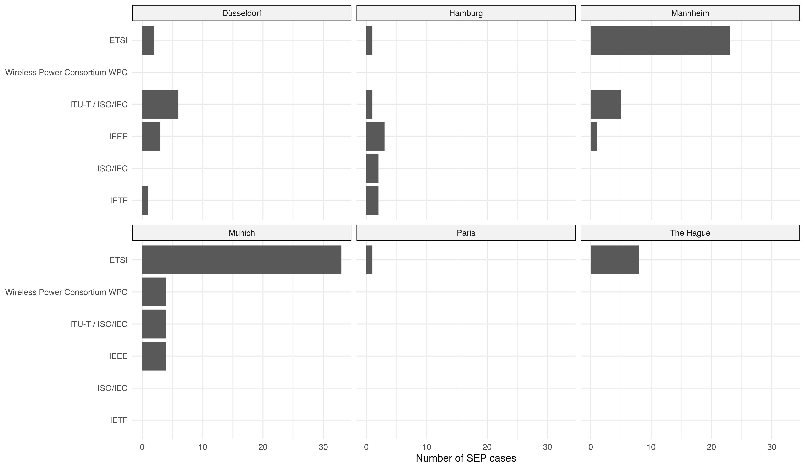

# Stage_BxSE

## Summary of figures / Main results 

*Monthly SEP case volumes exhibit a clear upward trajectory, reaching a peak in late 2025, whereas non-SEP litigation remains relatively stable at low levels*

*SEP disputes accounted for nearly one-third (29.2%) of all patent litigation before the three major German patent courts over the study period.*
*Note: jurisdictions with null SEP cases have been removed from the plot for readability*

*Across all jurisdictions, litigants were predominantly headquartered in the United States and China, followed by Germany, the Netherlands and Japan*

*SEP litigation is concentrated in ICT technologies, whereas non-SEP disputes are distributed across ICT, mechanical, chemical, and instrumentation patents.*

*Compared with non-SEP litigation, SEP cases involve a higher proportion of PAEs (26.0% v. 11.1%), while non-SEP cases are dominated by downstream operating firms*

*Only about 5% of SEP disputes results in a judicial decision, with the remaining ending in settlement or having no publicly available outcome.*

*SEP litigation is concentrated among a small group of repeat litigants: Panasonic initiated the largest number of cases (18), while Xiaomi was the most frequently sued company (20).*

*ETSI accounts for 65.4% of all identified SEP cases, with Munich and Mannheim serving as the primary litigation courts.*

