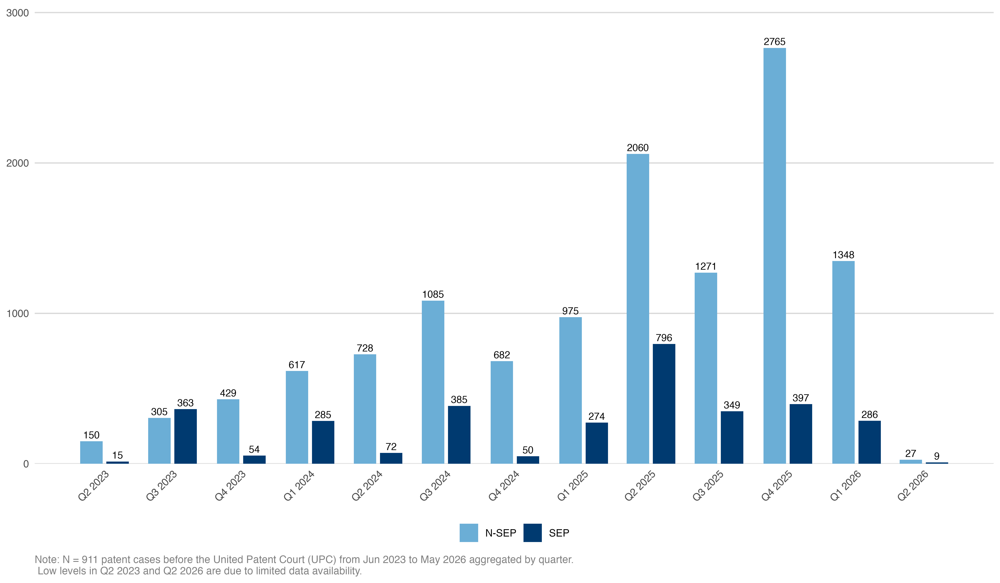
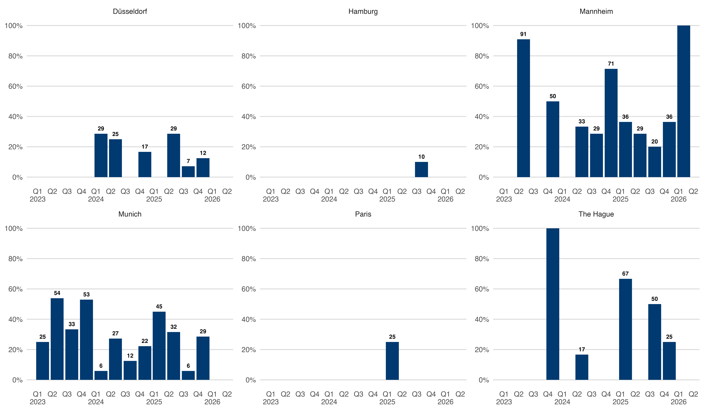
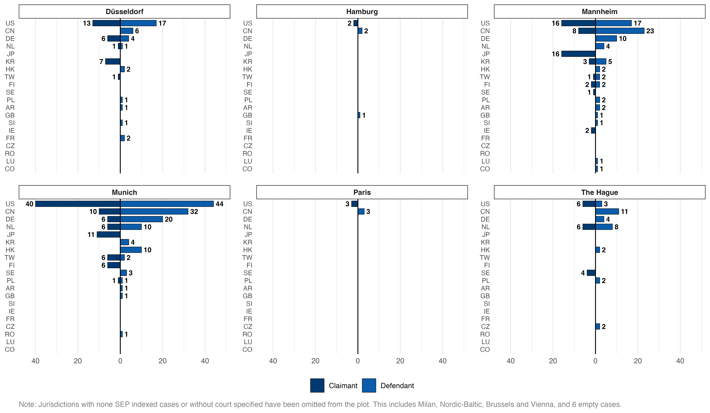
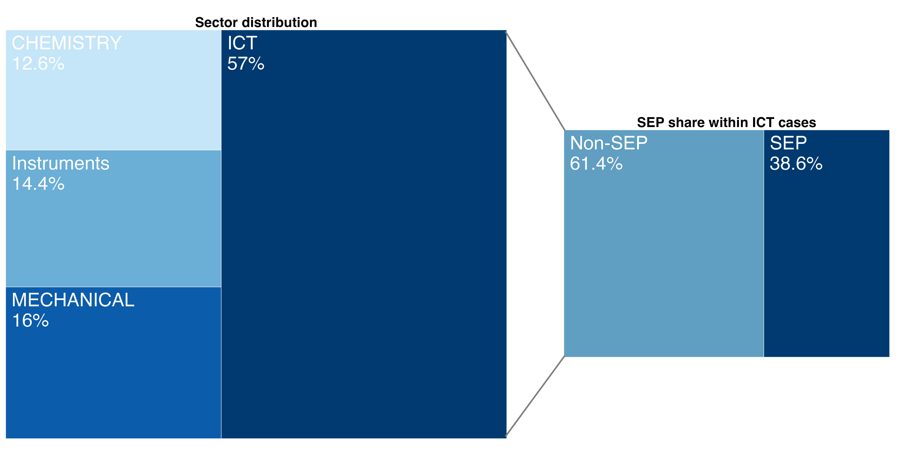
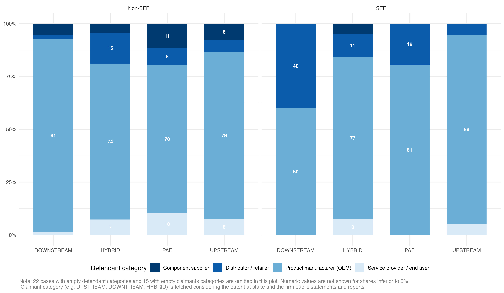
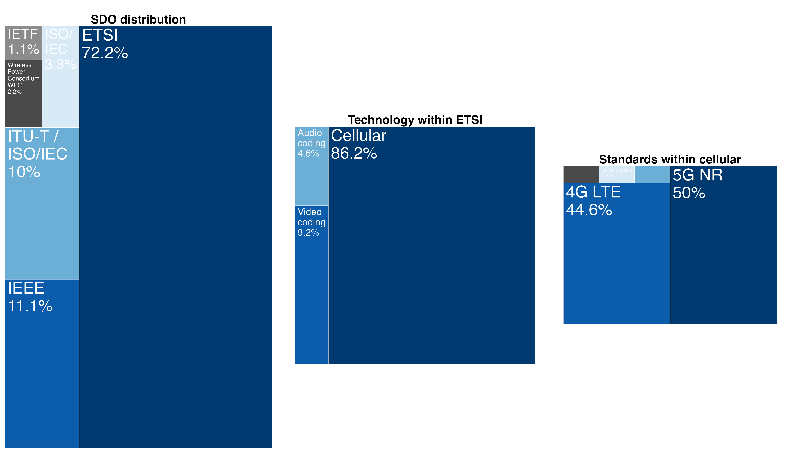
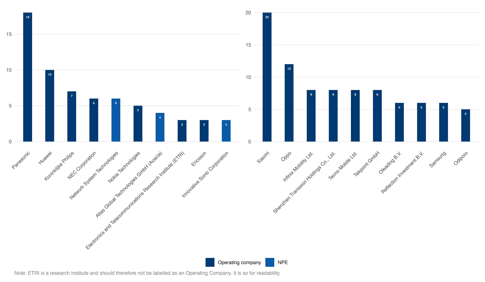
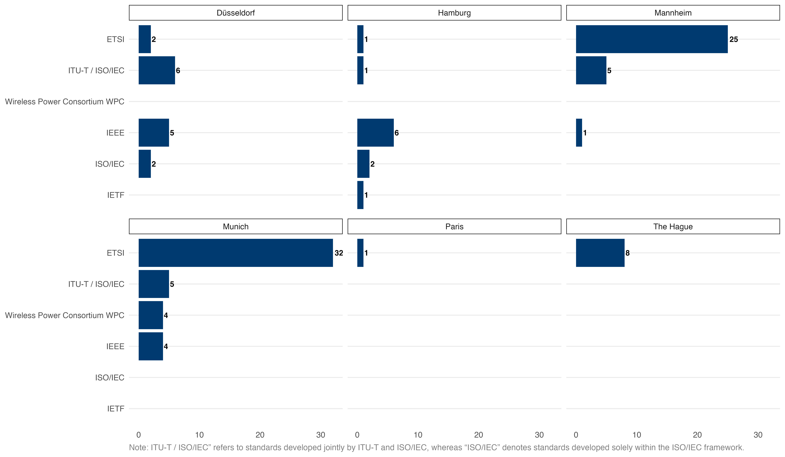

# Stage_BxSE

## Summary of figures / Main results 

*Quarterly SEP case volumes exhibit a clear upward trajectory, reaching a peak in late 2025, whereas N-SEP litigation follows a similar but substantially larger upward trend.*

*SEP disputes accounted for nearly one-third (29.2%) of all patent litigation before the three major German patent courts over the study period.*
*Note: jurisdictions with null SEP cases have been removed from the plot for readability*

*Across all jurisdictions, litigants were predominantly headquartered in the United States and China, followed by Germany, the Netherlands and Japan*

*ICT accounts for 57% of all patent cases before the UPC. Within ICT, 38.6% of cases involve SEPs.*

*Compared with N-SEP litigation, SEP disputes involve relatively more upstream firms and PAEs, whereas N-SEP litigation is dominated by downstream firms.*

*ETSI accounts for over 70% of identified SEP families. Within ETSI, Cellular technologies dominate, with 4G LTE and 5G NR accounting for the majority of standards.*

*SEP litigation is concentrated among a small group of repeat litigants: Panasonic initiated the largest number of cases (18), while Xiaomi was the most frequently sued company (20).*

*ETSI dominates across jurisdictions, with Munich and Mannheim accounting for the largest number of ETSI-related SEP cases.*

